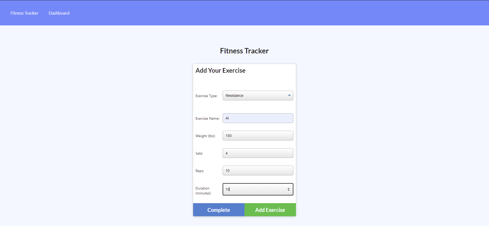

# fitness-tracker

## Unit 17 NoSQL Homework: Workout Tracker

## Description

This assignment required the creation of a fitness tracker utilizing a Mongo database with Mongoose schema and routes with Express. 

Tracks users daily workouts. 

## Screenshot

The following image shows the web application's appearance and functionality:

## Deployed Project Location:

* Page published at: https://fitness-tracker-hwk.herokuapp.com/ 

## Technologies 

JavaScript, Node.js, Express.js, NoSQL/MongoDB, Mongoose, Heroku 